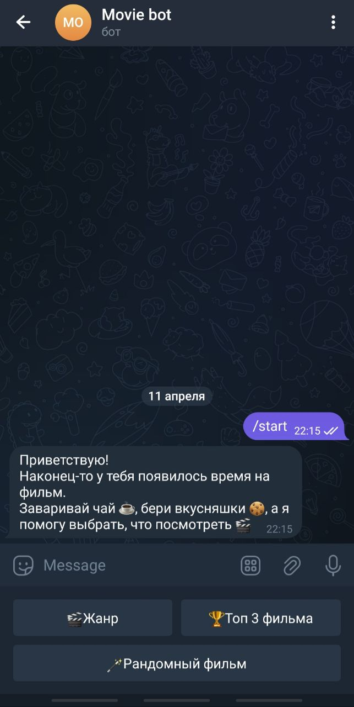
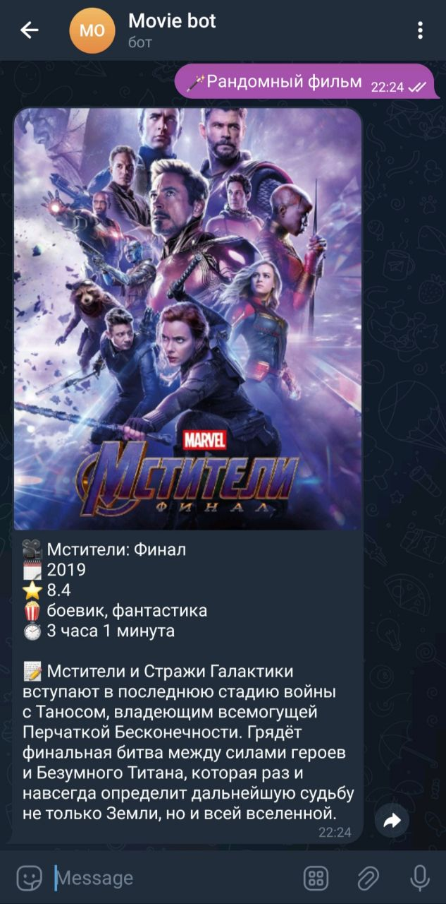
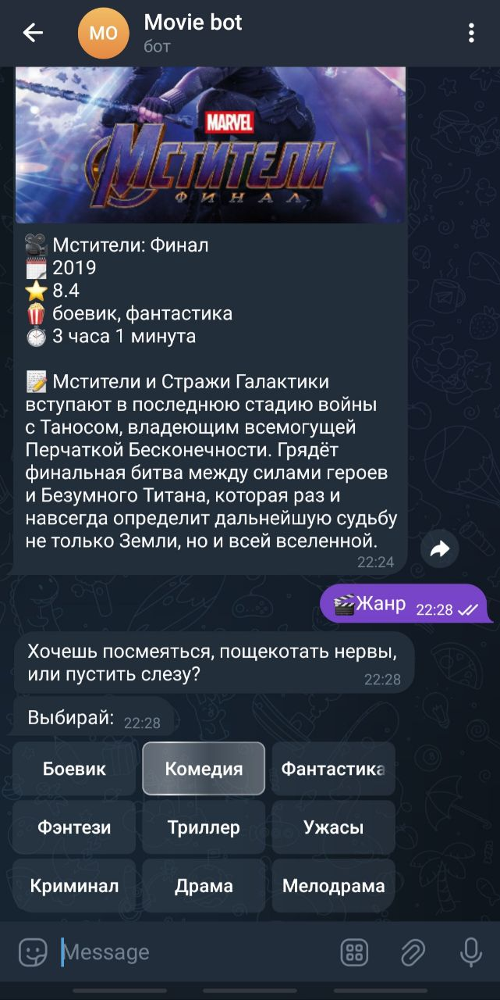
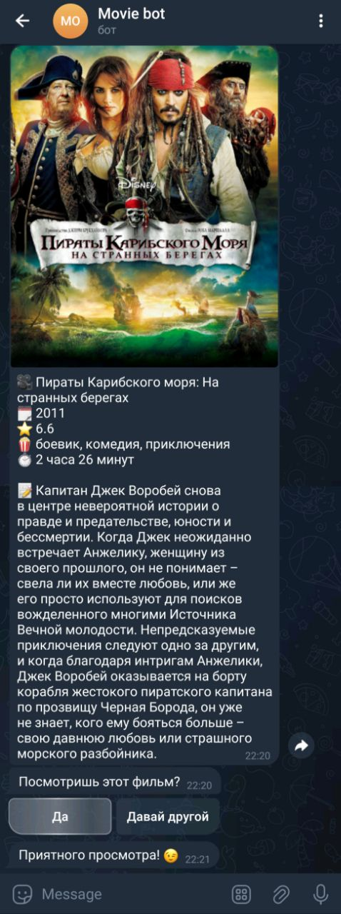

# Telegram Movie Bot

Этот Telegram-бот рекомендует фильмы пользователю по жанру, рейтингу или случайным образом. Использует PostgreSQL-базу данных для хранения фильмов.

Ссылка на бота: [Movie_bot](https://t.me/Good7MovieBot)

## Возможности

- Получение фильмов по жанру
- Топ-3 фильма с рейтингом 7+
- Рандомный фильм
- Уточнение: "Посмотреть этот или другой?"

## Технологии

- Python
- PostgreSQL (Supabase)
- Render (деплой)
- UptimeRobot (поддержание активности)

## Скриншоты

<h3>Старт</h3>

<h3>Рандомный фильм</h3>

<h3>Рекомендация по жанру</h3>

